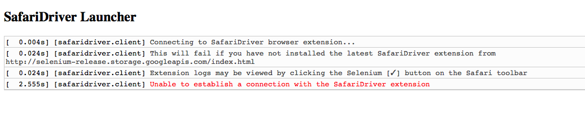

# Example

Selenium 2.53 does not appear to work with Safari any more.

# Versions

* Selenium Version: 2.53
* SafariVersion: Version 9.1.1 (10601.6.17)
* SafariDriver extension version: WebDriver 2.48.0
* OS X: 10.10.5


# Steps to Reproduce

Install [Safari Extension](http://selenium-release.storage.googleapis.com/2.53/SafariDriver.safariextz)
Selenium 2.53 will be installed and started using the steps below:

In one window:
```
npm install
npm run selenium
```
In a second window:
```
npm run test
```


### Error:



```
Build info: version: '2.53.0', revision: '35ae25b', time: '2016-03-15 17:00:58'
System info: host: 'denver-pair56', ip: '10.38.3.35', os.name: 'Mac OS X', os.arch: 'x86_64', os.version: '10.10.5', java.version: '1.8.0_25'
Driver info: driver.version: unknown
	at org.openqa.selenium.remote.server.DefaultDriverProvider.callConstructor(DefaultDriverProvider.java:113)
	at org.openqa.selenium.remote.server.DefaultDriverProvider.newInstance(DefaultDriverProvider.java:97)
	at org.openqa.selenium.remote.server.DefaultDriverFactory.newInstance(DefaultDriverFactory.java:60)
	at org.openqa.selenium.remote.server.DefaultSession$BrowserCreator.call(DefaultSession.java:222)
	at org.openqa.selenium.remote.server.DefaultSession$BrowserCreator.call(DefaultSession.java:1)
	at java.util.concurrent.FutureTask.run(FutureTask.java:266)
	at org.openqa.selenium.remote.server.DefaultSession$1.run(DefaultSession.java:176)
	at java.util.concurrent.ThreadPoolExecutor.runWorker(ThreadPoolExecutor.java:1142)
	at java.util.concurrent.ThreadPoolExecutor$Worker.run(ThreadPoolExecutor.java:617)
	at java.lang.Thread.run(Thread.java:745)
Caused by: java.lang.reflect.InvocationTargetException
	at sun.reflect.NativeConstructorAccessorImpl.newInstance0(Native Method)
	at sun.reflect.NativeConstructorAccessorImpl.newInstance(NativeConstructorAccessorImpl.java:62)
	at sun.reflect.DelegatingConstructorAccessorImpl.newInstance(DelegatingConstructorAccessorImpl.java:45)
	at java.lang.reflect.Constructor.newInstance(Constructor.java:408)
	at org.openqa.selenium.remote.server.DefaultDriverProvider.callConstructor(DefaultDriverProvider.java:103)
	... 9 more
Caused by: org.openqa.selenium.remote.UnreachableBrowserException: Failed to connect to SafariDriver after 10058 ms
Build info: version: '2.53.0', revision: '35ae25b', time: '2016-03-15 17:00:58'
System info: host: 'denver-pair56', ip: '10.38.3.35', os.name: 'Mac OS X', os.arch: 'x86_64', os.version: '10.10.5', java.version: '1.8.0_25'
Driver info: driver.version: SafariDriver
	at org.openqa.selenium.safari.SafariDriverCommandExecutor.start(SafariDriverCommandExecutor.java:121)
	at org.openqa.selenium.safari.SafariDriver.startClient(SafariDriver.java:76)
	at org.openqa.selenium.remote.RemoteWebDriver.<init>(RemoteWebDriver.java:119)
	at org.openqa.selenium.remote.RemoteWebDriver.<init>(RemoteWebDriver.java:144)
	at org.openqa.selenium.safari.SafariDriver.<init>(SafariDriver.java:62)
	at org.openqa.selenium.safari.SafariDriver.<init>(SafariDriver.java:53)
	... 14 more
16:30:25.120 WARN - Exception: Failed to connect to SafariDriver after 10058 ms
```
